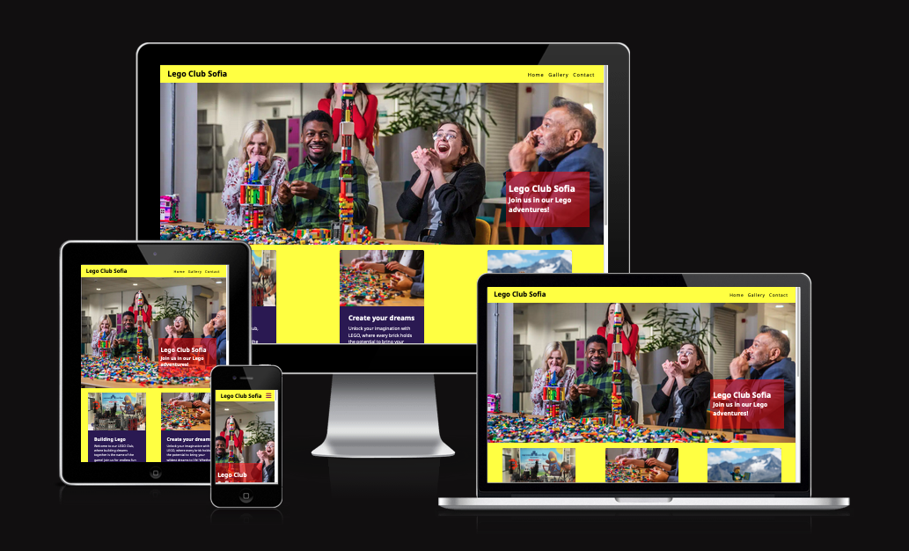
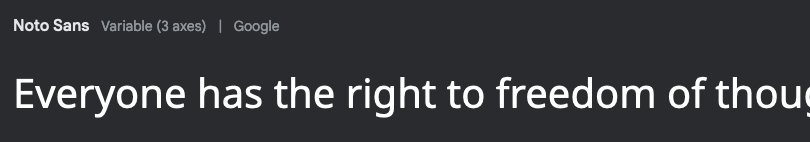
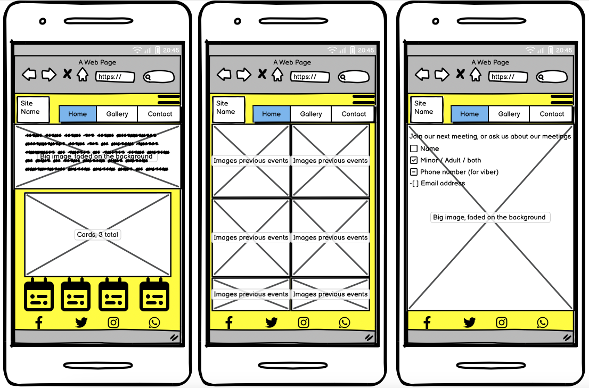

# Lego Club Sofia

Welcome my first project in the Full Stack Developer program. For this project, I imagined an informative site for a local Lego club. The site should show some information, what to do, where to meet, and a contact page. This is all build with HTML and CSS only as this was the primary assignement. 

You can access the site live here: [Website Lego Club Sofia](https://tbergius.github.io/Lego-Sofia/index.html)

---
## User Experience

### First Time Visitors
- Gain an understanding of the club and its activities.
- Discover the location and schedule of club meetings.
- View images of past Lego community events.
- Contact the club to express interest in joining.

### Returning Visitors
- Check the calendar for upcoming events and produce planting/harvesting schedules.
- Easily navigate to the contact page to communicate with the club.

---
## Features

### Pages
There are 4 pages. 3 directly accesible pages, and a contact form confirmation page.

- Main/index page: This shows a cover image, 3 cards with a picture and information, 3 tiles for next events, and a footer.
- Gallery page: To showcase images from members and events.
- Contact page: A page to leave your details for more information.

### Main page
- Navigation Bar: Easily navigate between the info page, gallery, and contact page. This repeats on every page.
- Landing Page Image: An eye-catching photograph of a group meeting that welcomes visitors, setting the tone for our Lego community.
- Club Ethos Section: Highlighting the educational, fun, and collaborative aspects of our meetups.
- Events dates Section: Stay updated on when and where our events take place.

### Future Features
- Message Board: Engage with fellow members and share experiences.
- Social Media Integration: Stay connected and get involved through our social channels.
- User-Submitted Content: Showcase member creations and event photos.

---
## Design

### Colour Scheme
I went for a palette that reflects the Lego brand colors. These are basics yellow, red, purple, white and black. 

### Typography
I used the Noto sans from Google Fonts as it matches the font used on the Lego site. The text items are short so the clean font should make it easy to read in glance.

### Images
All images are carefully selected to showcase the club's activities and creations, providing an engaging visual experience for visitors.

### Content
The content on the site is created to reflect the particular parts of the site. This was inspired by own experiences and stories/videos from other Lego enthusiasts. 

---
## Wireframes

I do not have a lot of experience yet with making wireframes or creating things from scratch, I did make this mock-up which looked pretty ok! This also gave me a cleared goal on what to do, and where things should go. 

---
## Technology

- HTML - This is the foundation code the website is written in.
- CSS - The style structure used.
- Environment - I used Codeanywhere at the beginning to write, commit, and push the code. When this was no longer working, I changed to Gitpod and finsihed the project there.
- Google Fonts - I used the fonts and links to the font from Google Fonts.
- Font Awesone - The icons on the site are taken from here.
- Wepik - I used this AI tool to make the background image for the contact and confirmation page.
- Amiresponsive - For creating the nice picture featured at the start.
- Balsamic - This I used to create the wireframes.
- w3 validator - The validator used to check the HTML and CSS.

---
## Deployment
Our website is deployed using GitHub Pages. Visit the live site [Website Lego Club](https://tbergius.github.io/Lego-Sofia/index.html).

## Validator Testing
- HTML: Passed without errors according to the official W3C validator.
- CSS: No errors found using the official (Jigsaw) validator.

---
## Credits
### Content
- Content written by me (Thomas) with assistance from ChatGPT.
- Main page layout and structure is inspired by the Love Running project from Code Institude

### Media
- Landing page photo from [Bricks McGee](https://www.bricksmcgee.com/lego-user-groups-lugs-in-the-uk/).
- Several images take from Adobe free library
- Gallery images sourced from: 
  - [Gallery 1](https://btvnovinite.bg/galeria/galleries/izlozhba-na-unikalna-kolekcija-ot-lego-vlakovi-modeli-video-i-snimki.html/1071?image=7)
  - [Gallery 2](https://forum.lebgo.org/)
  - [Gallery 3](https://pixabay.com/)
