# Testing and bug fixes

In order to deploy a functional site, and optimise uder experience, the site went through the test methods below. Under the testing part, you can also find a section with found bugs that were addresses.

---
## Testing

---
1. This site works well in Google Chrome, Safari, and Firefox.

- Google Chrome

- Firefox
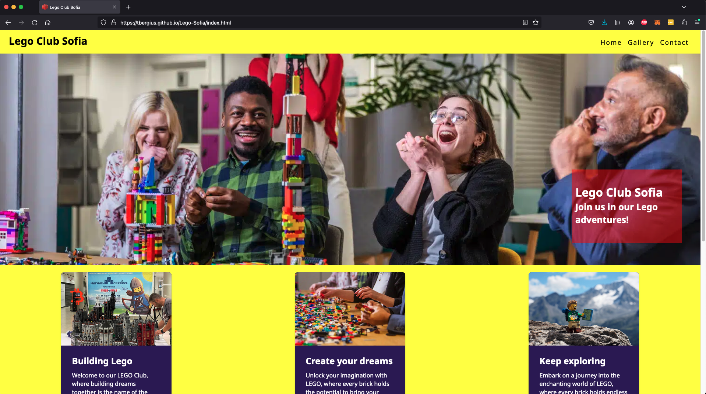

- Safari

---
2. This site works well on mobile screen sizes. It was build and tested with the "Mobile First" methodology as adviced in the "Love Running" program. I did most of the coding in Firefox, and checked for responsivenes in Firefox, changing screne sizes. At the end of a coding day, I also double checked to responsiveness in Google Chrome.  For the final test, I used "Responsive Viewer" to check all pages on the most used devices.

- Home page

- Gallery page
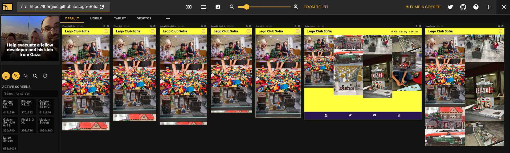

- Contact page

---
3. Manual tests. All pages and clickable links or buttons were tested in different browsers, as well testing was performed on smaller screen sizes via the browser inspect option. There is only one page where a user can enter information, this was tested in detail. 

Contact form fields testing. Steps taken to test:

- Click on “Contact” in the menu
- Leave the Name field empty, but have the other fields with something: 
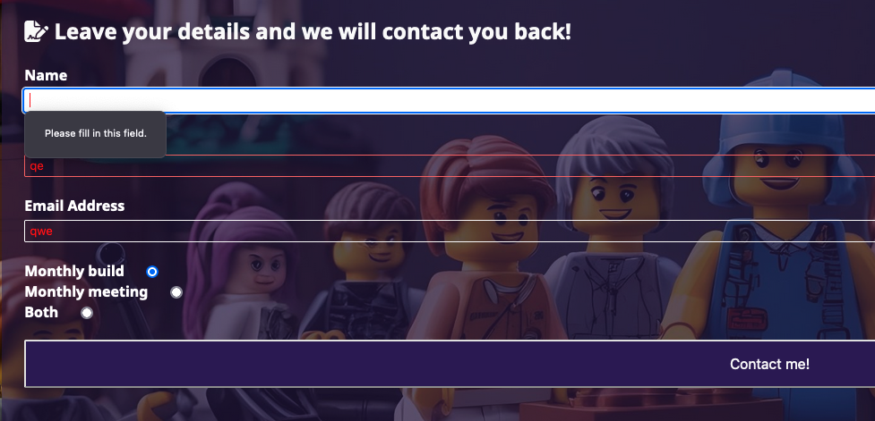

- Leave the phone field empty, but have the other fields with something: 
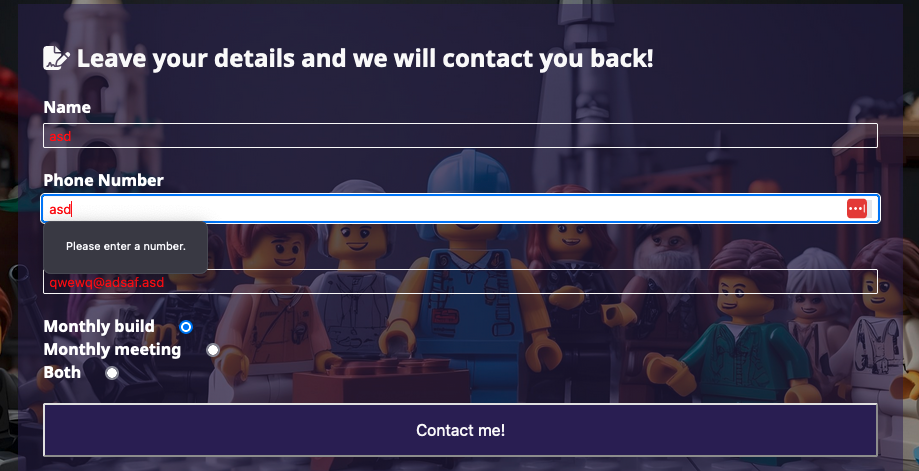

- Leave the email field empty, but have the other fields with something: 
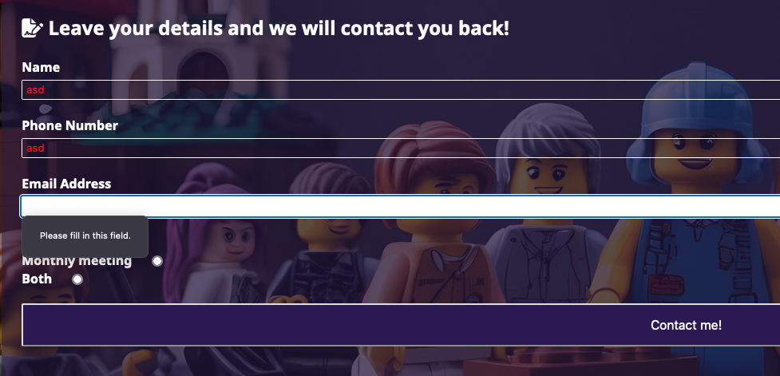

- Enter an email address without @, but have the other fields with something: 

- Click on submit, and check for re-direct:
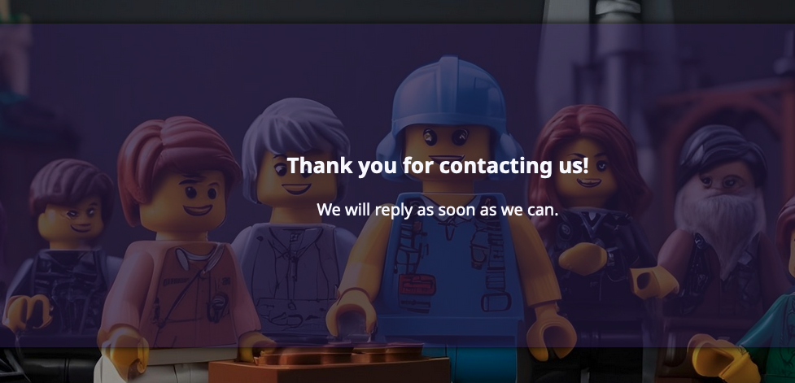

4. Accessibility testing: To make sure that pages are accessible for everyone, I used the "Wave" from WebAIM. 

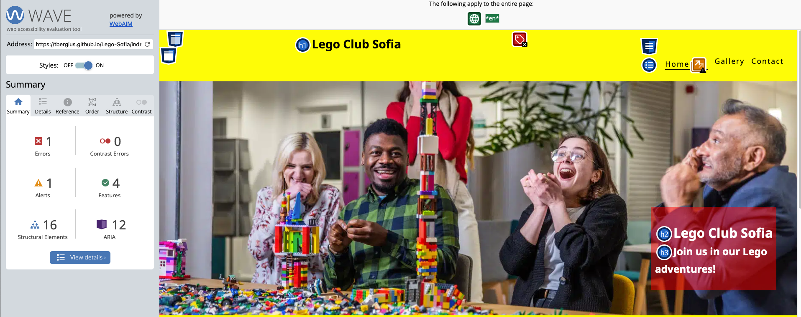

---
## Validator results

- The HTML was tested on the HTML validator with W3C
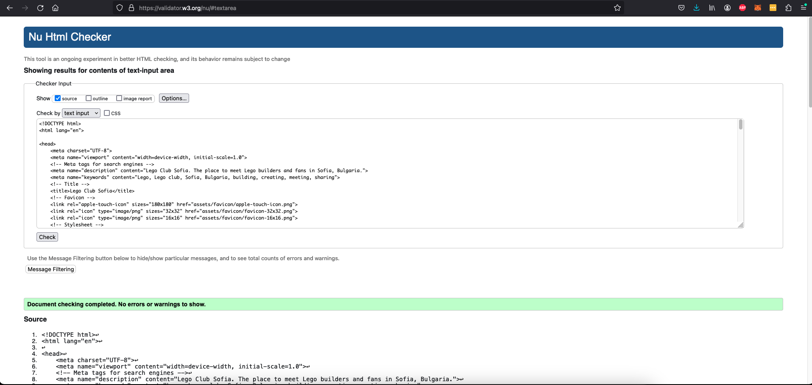

- The CSS was tested on the CSS validator with W3C

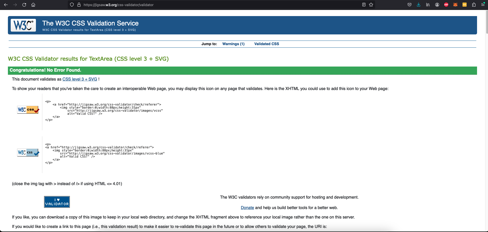

- Another test was performed using the Lighthouse extension in Google Chrome

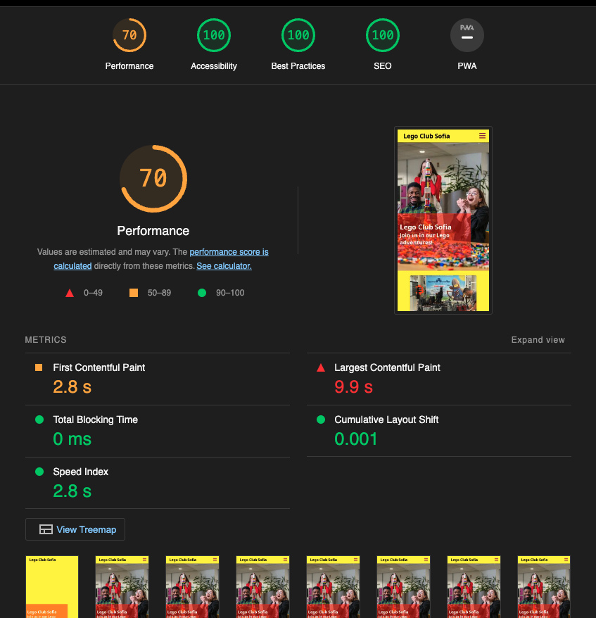

---
## Bugs and fixes

During the coding phase and the testing phase, some bugs were found and addressed.

- Contact form, phone number field. This field was set to accept text, and not number. This was changed in the code and is now correct.

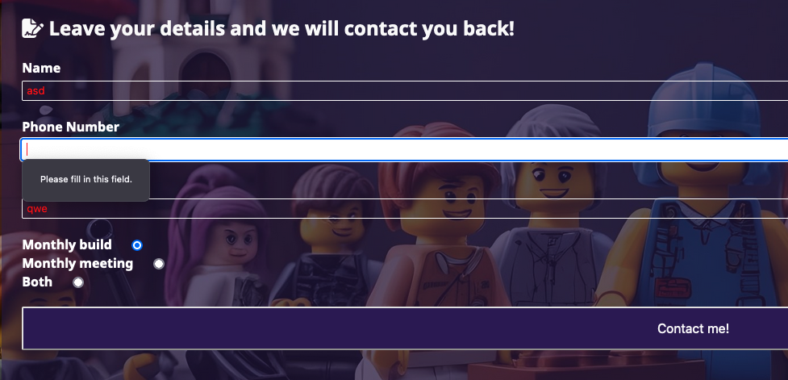

- The contact form did not show well for screens of 280px, as I tested during coding for screens of 320px. This has been updated to include some padding.

- Honorable for an issue on my main page. I could not get the sections for "Cards" and "Events" to work. The events would move to the right of the cards or larger screens, no matter what I tried. Sometimes even the format would mess up and expanded the event items. With help from the cavalry, tutor John, managed to fix it my placing the items in the correct containers. An error on my part that too long to spot. #lessonlearned 

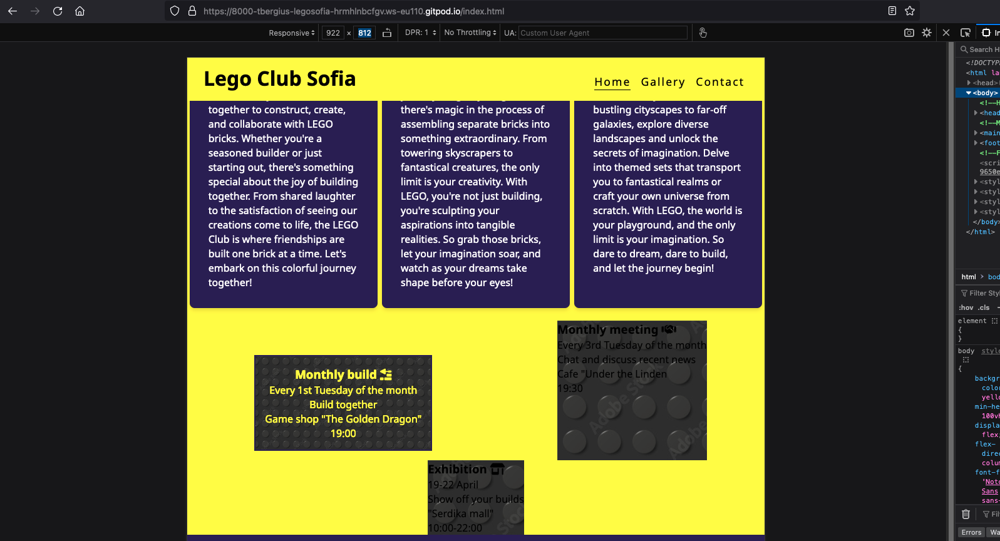
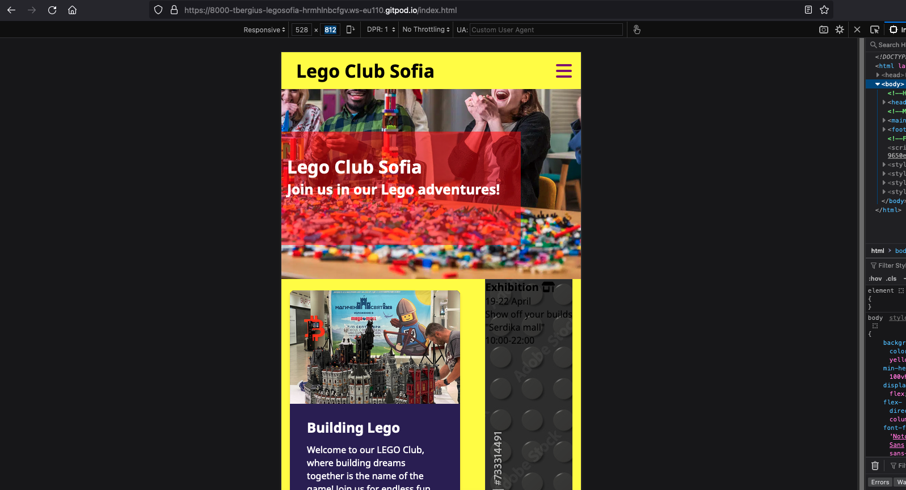
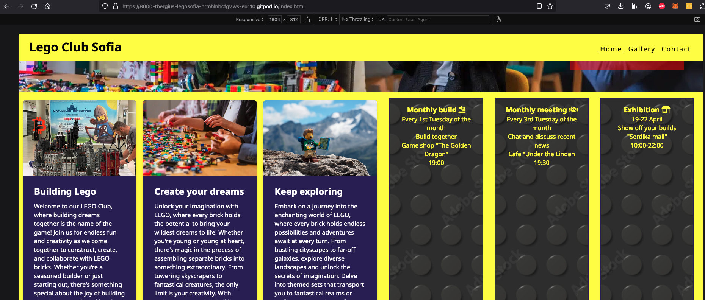